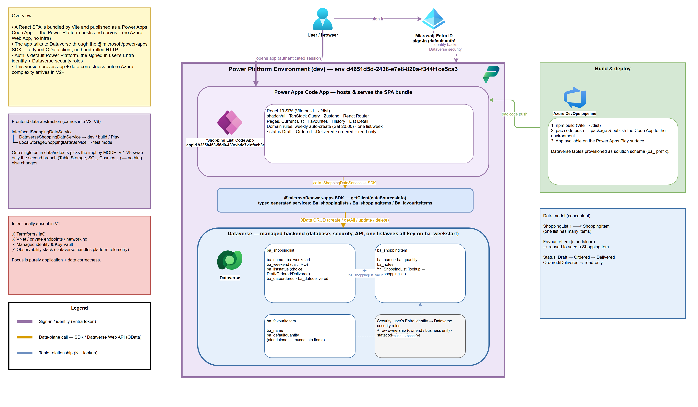

# Version 1 Power App Code App
Version 1 of my Shopping List App is a Power App Code App with a React frontend and a Dataverse backend.

## Solution Components
- **Code App**: Fully fledged React web application, providing enhanced UI/UX than a traditional Canvas App.
- **Power Automate**: Cloud Flow to automatically create a blank shopping list for the week ahead.
- **Dataverse**: Data source to store; weekly shopping lists, individual items, and favourite items.

## Architectural Diagram
