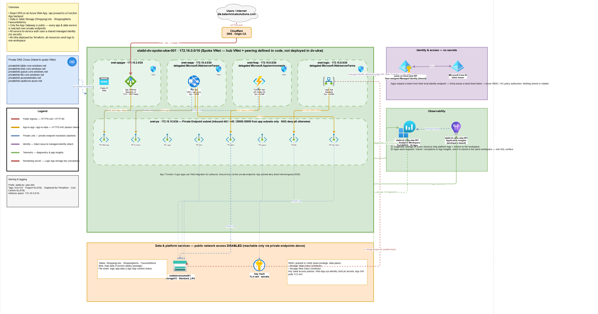

# Version 2 Azure Table Storage
Version 2 of my Shopping List App has the same frontend UI/UX as version 1 but a backend that is now deployed to Azure. This version moves the application from a managed platform in Power Platform to a user deployed platform on Microsoft Azure.

## Solution Components
- **Terraform**: IaC modules to deploy all Azure infrastructure.
- **Application Gateway**: Secure entry point to my application URL.
- **Azure Web App**: Hosts the React web application.
- **Azure Table Storage**: Data source to store; weekly shopping lists, individual items, and favourite items.
- **Logic App**: Automation to create a blank shopping list for the week ahead.
- **Function App**: API layer to communicate between frontend UI and backend data source.
- **Key Vault**: Secure storage for domain SSL certificate private key.
- **Private Endpoints**: Private communication between all resources.
- **Managed Identity**: Secure (no secrets) authentication between all resources.
- **Log Analytics**: Diagnostic logging enabled on all resources. 
- **Azure DevOps Pipelines**: To deploy infrastructure and application code.

## Architectural Diagram
