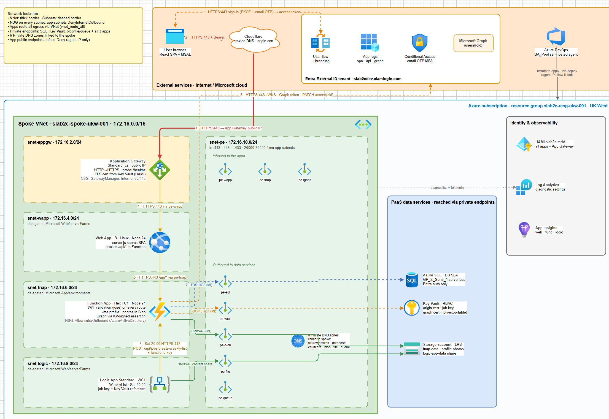

# Version 4 External Entra ID
Version 4 of my Shopping List App has the same frontend and backend database as version 3 but an added layer of security and authentication via External Entra ID (formerly Azure B2C). Users get a custom sign-up/sign-in experience and the site is secured with MFA

## Solution Components
- **Terraform**: IaC modules to deploy all Azure infrastructure and the External Entra ID tenant.
- **Application Gateway**: Secure entry point to my application URL.
- **Azure Web App**: Hosts the React web application.
- **Azure SQL Database**: Data source to store; weekly shopping lists, individual items, and favourite items.
- **External Entra ID**: External Entra ID that allows for secure MFA access to the site. 
- **Logic App**: Automation to create a blank shopping list for the week ahead.
- **Function App**: API layer to communicate between frontend UI and backend data source.
- **Key Vault**: Secure storage for domain SSL certificate private key.
- **Private Endpoints**: Private communication between all resources.
- **Managed Identity**: Secure (no secrets) authentication between all resources.
- **Log Analytics**: Diagnostic logging enabled on all resources. 
- **Azure DevOps Pipelines**: To deploy infrastructure and application code.

## Architectural Diagram

## Video Demonstration

